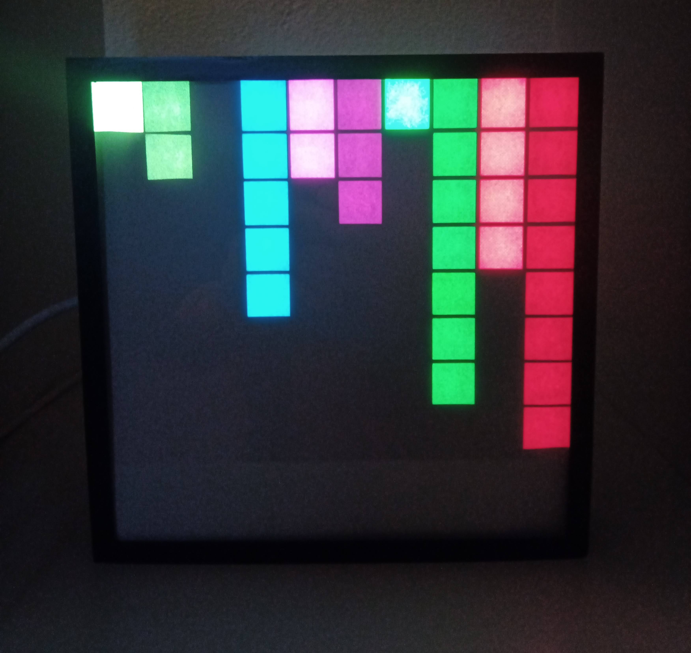

# Wled grid time

This little code snippet I use to show the current time on my ESP32 10x10 RGB led grid with [WLED](https://kno.wled.ge/).

## Virtual demo

[filipchalupa.cz/wled-grid-time/](https://filipchalupa.cz/wled-grid-time/)

## Example of december 5th 23:17:48

